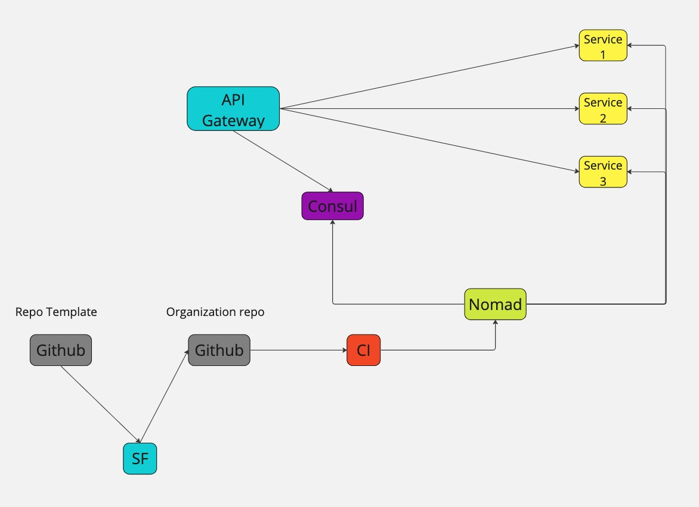

# Service Factory
Repository as code

## Description
Service Factory facilitates the onboarding of new services in your organization by automating the redundancies in setting up a new repository.
It employs a Pull-Render-Push (Connect) method that allows teams to describe and deploy new services in their organization by automating their repository creation. Allowing the dev team to start coding faster. By leveraging infrastructure as code, Service Factory reduces the time to market of a new service at the organization level while promoting standardization within your service repositories and a GitOps development workflow.

## Service Factory service deployment lifecycle


## Repository provider support
For now, only Github and Gitlab are supported.

## Installation
```bash
wget https://github.com/cloudputation/service-factory/releases/download/${VERSION}/service-factory -O ./factory
chmod +x ./factory
mv ./factory /usr/local/bin/
```

## Configuration
By default, Service Factory looks for `/etc/service-factory/config.hcl`

Here is an example server config file
```hcl
log_dir = "path/to/log"
data_dir = "path/to/sf-data"

server {
  port    = "4884"
  address = "127.0.01" // server address for cli to lookup
}

consul {
  consul_host   = "127.0.0.1"
  consul_token  = CONSUL_TOKEN
}

repository {
  gitlab {
    access_token = GITLAB_TOKEN
  }
  github {
    access_token = GITHUB_TOKEN
  }
}
```

## Usage
### Run service
```bash
factory agent
```

### Apply new services
From another terminal
```bash
factory apply --service-file path/to/service1.hcl --service-file path/to/serviceN.hcl
```
### Destroy new services
```bash
factory destroy --service service_name --service service_name
```

### Example service specs files
```hcl
service {
  name    = "test-service1"
  group   = "test-apis"
  port    = "9900"
  tags    = ["SF-Managed"]

  template {
    template_url  = "github.com"
    template      = "cloudputation/cookie-cutter-api"
  }

  repository {
    provider  = "github"
    config {
      registry_token    = GITLAB_REGISTRY_TOKEN
      repository_owner  = "cloudputation"
    }
  }

  // Cookie Cutter rendering variables only
  // Those variables are only used when rendering .ck files
  network {
    authoritative_server  = "127.0.0.1" // Typically a nomad server
    target_host           = "backend1"  // Typically a nomad client
  }
}
```

## Cookie Cutters
Service Factory allows for cookie cutter repository creation using the go-template engine. Every value in a service spec file can be used in templates. Example of a cookie cutter file intended to render a Dockerfile with the service's port by using `{{.Service.Port}}`
```go
FROM ubuntu:22.04

WORKDIR /app


RUN apt update
RUN apt -y upgrade
RUN apt -y install python3 python3-pip

COPY ./requirements.txt /app/requirements.txt
COPY ./API_VERSION /app/API_VERSION
COPY ./service.py /app/service.py


RUN python3 -m pip install --no-cache-dir --upgrade -r /app/requirements.txt


CMD ["uvicorn", "service:app", "--host", "0.0.0.0", "--port", "{{.Service.Port}}"]

```
## Example Cookie Cutters
2 example cookie cutters are provided but you may use or create any desired repository template.

`github.com/cloudputation/cookie-cutter-api`<br>
`gitlab.com/cloudputation/cookie-cutter-api`<br>
For now, only those are available but more are to come in a further release.

## Internal Terraform
Service Factory uses Terragrunt to execute Terraform code under the hood as part of its main components.

## Consul Backend
For now only Consul is supported as Terraform backend

## Repository as a service
Service Factory registers created repositories to Consul with a health check that confirms its existence. It will use the configured (/etc/service-factory/config.hcl) github or gitlab token to ping a private repository.

## Application Metrics
Basic prometheus format metrics can be collected at http://sf_address:4884/v1/system/metrics

`agent_errors`<br>
`health_endpoint_hits`<br>
`apply_endpoint_hits`<br>
`destroy_endpoint_hits`<br>
`repo_status_endpoint_hits`<br>
`service_status_endpoint_hits`<br>
`system_status_endpoint_hits`<br>
`system_metrics_endpoint_hits`<br>

Other metrics are general go specific metrics.

## Server API
Although it is possible to use the CLI to deploy or decommission service repositories, Service Factory's endpoints can be used directly

Deploy service repository
```bash
curl -X POST -data@service.json http://127.0.0.1:4884/service/apply
```
service.json
```json
{
  "service": {
    "name": "test-service1",
    "group": "test-apis",
    "port": "9900",
    "tags": ["SF-Managed"],
    "template": {
      "template_url": "github.com",
      "template": "cloudputation/cookie-cutter-api"
    },
    "repository": {
      "provider": "github",
      "config": {
        "registry_token": "GITLAB_REGISTRY_TOKEN",
        "repository_owner": "cloudputation"
      }
    },
    "network": {
      "authoritative_server": "127.0.0.1",
      "target_host": "backend1"
    }
  }
}
```

Decommission service repository
```bash
curl -X POST -data@service.json http://127.0.0.1:4884/service/destroy
```
service.json
```json
{
  "service-names": ["service1", "service2", "service3"]
}
```

## Contributing

Feel free to create an issue or propose a pull request.

Follow the [Code of Conduct](CODE_OF_CONDUCT.md).
